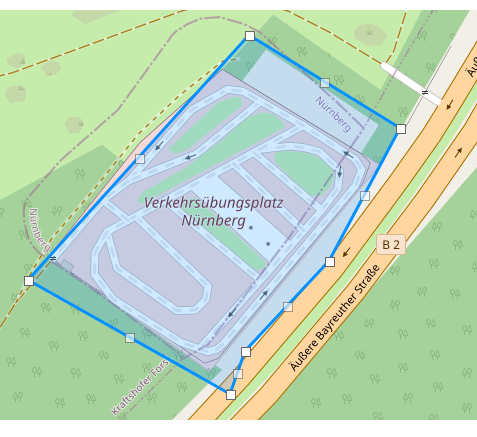

# NüCC Nürnberg City Challenge

[NüCC Nürnberg City Challenge](https://coord.info/GC5PK8F)
### Fixes
* Fix encoding problems
* Automatic GSKZ build
* Use original coordiates

### Unterschiedliche Gebiete
Ein Vergleich mit OSM Daten zeigt den ein oder anderen Unterschied bein den Fläche der BVG

### Encoding Polygon files
* Windows 1252
* CRLF

### Datenquelle
https://geoportal.nuernberg.de/server/services/Fachdaten/Gebietsgliederungen/MapServer/WFSServer?service=WFS&version=1.1.0&request=GetFeature&srsName=EPSG:4326&bbox=49,10,50,12,EPSG:4326&typeName=B%C3%BCrgerversammlungsgebiete

### GSKZ Datei
